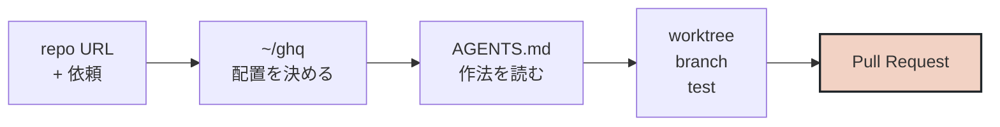

## 短い依頼で済むようになった

たとえば、いまなら次のような依頼でかなり話が通る。

```
https://github.com/example/repo

このリポジトリで、issue の内容を実装して、テストを通して、PR まで作って。
```

これは「エージェントがすごく賢いので、あとは雰囲気で全部やってくれる」という話ではない。
毎回説明したくない作業規約を、あらかじめ環境側に置いているから短くできる。

## ~/ghq を起点にすると、リポジトリの場所を説明しなくてよくなる

GitHub のURLを渡されたとき、まずローカルの ghq root を見る。すでに clone 済みならそのリポジトリを使う。
なければ確認して、明示された場合だけ取得する。これだけで「どこで作業するか」という会話がかなり減る。

人間にとっても、エージェントにとっても、入口が揃っているのは大きい。
リポジトリごとに置き場所を探したり、似た名前のディレクトリを推測したりしなくてよくなる。

## AGENTS.md は、毎回言いたくないことを書く場所

コーディングエージェントに毎回長いプロンプトを書くより、作業規約をドキュメントとして置いておくほうが安定する。
たとえば、次のようなことは AGENTS.md に寄せられる。

- 作業は git worktree で行う
- default branch を最新化してから作業を始める
- 既存の作業ブランチがあるなら、それを確認してから使う
- 破壊的な git 操作は勝手にしない
- PR はレビュー可能な状態で作る
- テスト、レビュー、CI の結果をPR本文や完了報告に含める
- 公開物に個人情報や秘密情報を書かない

これはプロンプト芸というより、チーム開発でいう「開発ルール」のエージェント版に近い。
人間のメンバーにオンボーディング資料を渡すのと同じように、エージェントにも作業前提を読ませる。

## PR という成果物に乗せると、レビューできる

コード片をチャットで受け取るだけだと、そこから先は人間が運用に戻さないといけない。
でも PR になっていれば、差分、コミット、説明、テスト結果、CI が既存のレビュー導線に乗る。

ここが一番重要だと思っている。エージェントの出力を特別扱いせず、普段の開発プロセスで検査できる形にする。
そうすると、人間は「生成されたコードを貼る係」ではなく、仕様、リスク、設計、レビューの判断に集中しやすくなる。

## 任せやすい作業と、人間が握る作業

既存のパターンに沿う修正、ドキュメント更新、テスト追加、小さな不具合修正はかなり任せやすい。
一方で、プロダクト判断、セキュリティ境界、破壊的な移行、曖昧な仕様の決定は人間が握ったほうがよい。

だから「エージェントに全部任せる」ではなく、「PR まで作ってもらい、人間がレビュー可能な場所で受け取る」という使い方が今のところしっくりきている。

## まとめ

コーディングエージェントの便利さは、コードを生成することそのものより、レビュー可能なPRとして仕事を返してくれるところにある。
そのためには、エージェントが動ける地形を整える必要がある。

自分の場合、その地形の中心にあるのが ~/ghq と AGENTS.md だ。
リポジトリの場所を揃え、作業規約を明文化しておくと、依頼文は実装手順ではなく作業チケットに近づいていく。
